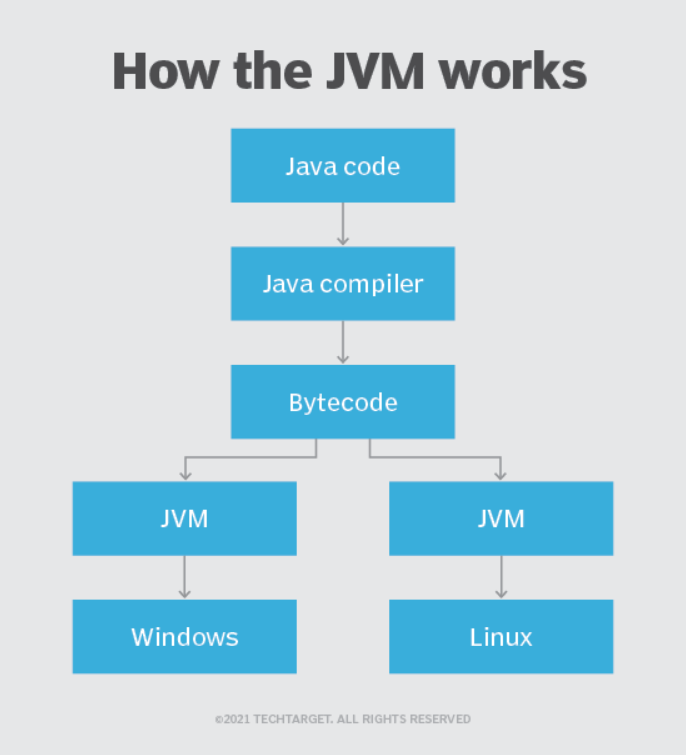

# Como o Java funciona

1. **Escrita do Código:**
    - Você escreve seu programa em um editor de texto, utilizando a sintaxe da linguagem Java.
    - O código é organizado em classes, que são como moldes para criar objetos.
2. **Compilação:**
    - O código fonte é passado para um compilador Java.
    - O compilador verifica se o código está escrito corretamente (sintaxe e semântica) e o converte em um formato intermediário chamado bytecode.
    - O bytecode é um conjunto de instruções que a máquina virtual Java (JVM) entende.
3. **Execução:**
    - A JVM (Java Virtual Machine) é um programa que lê o bytecode e o executa.
    - A JVM traduz cada instrução do bytecode para o código de máquina específico da plataforma onde está sendo executada.
    - Essa tradução permite que programas Java sejam executados em diferentes sistemas operacionais (Windows, Linux, macOS), desde que haja uma JVM instalada.



# Tipos de Variaveis
1. **Tipos Primitivos**
 - São os tipos básicos de dados que Java oferece. Eles armazenam valores simples e não são objetos.
# Tipos de Variáveis em Java


| Tipo         | Tamanho (byte) | Valor Padrão     | Faixa de Valores                            | Exemplos de Uso             |
|--------------|----------------|------------------|---------------------------------------------|-----------------------------|
| `byte`       | 8              | `0`              | -128 a 127                                  | Controle de memória em massa|
| `short`      | 16             | `0`              | -32.768 a 32.767                            | Sistemas embarcados         |
| `int`        | 32             | `0`              | -2³¹ a 2³¹-1                                | Números inteiros gerais     |
| `long`       | 64             | `0L`             | -2⁶³ a 2⁶³-1                                | Grandes cálculos inteiros   |
| `float`      | 32             | `0.0f`           | ±1.4E-45 a ±3.4028235E38                   | Números decimais simples    |
| `double`     | 64             | `0.0d`           | ±4.9E-324 a ±1.7976931348623157E308         | Números decimais precisos   |
| `char`       | 16             | `'\u0000'`       | '\u0000' a '\uffff' (0 a 65.535)            | Armazenamento de caracteres |
| `boolean`    | 1 (teórico)    | `false`          | `true` ou `false`                          | Lógica booleana             |

## Explicação dos Tipos
- **Variáveis primitivas**: Diretas e armazenam valores simples.
- **Exemplo de uso prático**:
    ```java
    int idade = 25;        // Inteiro
    double salario = 3500.75; // Ponto flutuante
    boolean ativo = true;  // Verdadeiro ou falso
    char inicial = 'A';    // Caracter
    ```
  
# Operadores aritméticos
Os operadores aritméticos são usados para realizar cálculos matemáticos. Os operadores são:
- Soma, subtração, divisão, multiplicação, modulo (que é o resto da divisão), incremento, decremento.
 ### Temos os operados Lógicos:
**Operador AND (&&)**
- o operador AND faz uma pergunta entre duas condições e retorna só VERDADEIRO se as **duas** condições forem verdadeiras

**Operador OR ( | | )**
- O operador OR faz uma pergunta entre duas condições e retorna só VERDADEIRO se pelo **menos** uma das condições forem verdadeiras

**Operador NOT ( ! )**
- O operador NOT faz uma negação de uma condição, se ela for verdadeira, ela vira falsa e vice-versa.
**Operador de Atribuição**
- os operados são: = (atribui/”recebe”), += ( ), -= ( ), *= ( ) , /= ( ) , %=,

# Estruturas condicionais
As estruturas condicionais em Java permitem controlar o fluxo de execução de um programa com base em condições específicas.
- A Condição IF significa “se”, ela verifica uma condição e se ela for verdadeira ele executa o codigo dentro do if
   ```java
     int idade = 18;
        if(idade >= 18){
            System.out.println("É maior de idade");
        }
    ```
  
- O else Significa “se não”, executa se a condição do if for falsa
   ```java
     int idade = 17;
        if (idade < 18) {
            System.out.println("Menor de idade");
        } else {
            System.out.println("É maior de idade");
        }
    ```
- Múltiplas condicionais if ... else podem ser aninhados quando necessário
```java
     int idade = 20;
        if (idade < 15) {
            System.out.println("Categoria Infantil");
        } else if(idade >= 15 && idade < 18) {
            System.out.println("Categoria Juvenil");
        }else{
            System.out.println("Categoria Adulto");
        }
    }
  ```

**Operador Ternário**
- Usamos o operador ternário qaundo a instrução resultante é extremamente curto e representa um aumento significativo na concisão sobre o if/else equivalente sem sacrificar a legibilidade.
sintaxe: `operadotr ternario (condição) ? faça algo : faça outa coisa`
- 
```java
   int idade = 17;
String mensagemMaior18 = "Pode tirar a carteira";
String mensagemMenor18 = "Não pode tirar a carteira";
String resultado = idade >= 18 ? mensagemMaior18 : mensagemMenor18;
        System.out.println(resultado); // Não pode tirar a carteira

/// oU
int idade = 18;
String resultado = idade >= 18 ? "pode tirar a carteira" : "Não pode tirar a carteira";
     System.out.println(resultado);//pode tirar a carteira
  ```
**Switch case**
- O Switch Case é uma estrutura de controle em Java que permite que você execute diferentes blocos de código com base em uma condição. Ele é frequentemente usado quando você precisa verificar vários valores para uma variável
```java
   int dia = 3;
switch (dia) {
        case 1:
        System.out.println("Segunda-feira");
        break;
                case 2:
                System.out.println("Terça-feira");
        break;
                case 3:
                System.out.println("Quarta-feira");
        break;
// e assim por diante...
default:
        System.out.println("Dia inválido");
}

  ```
# Estruturas de Repetição em Java

As estruturas de repetição em Java permitem executar um bloco de código várias vezes, enquanto uma condição for verdadeira. Existem três principais estruturas de laços em Java: for, while e do-while.
## 1. `for`

A estrutura `for` é usada quando o número de iterações é conhecido antes de iniciar o loop. É muito útil quando você tem um contador ou precisa iterar sobre um conjunto fixo de elementos.

### Sintaxe:
```java
for (inicialização; condição; incremento/decremento) {
    // código a ser executado
}
```
## 2. `While`
O while é usado quando a condição precisa ser verificada antes de cada iteração, ou seja, o loop pode não ser executado se a condição inicial não for atendida.
### Sintaxe:
```java
while (condição) {
    // código a ser executado
}
```

### Exemplo:
```java
int i = 0;
while (i < 5) {
    System.out.println("Iteração número: " + i);
    i++;
}
```

## 3. `do-while`
A estrutura do-while é similar ao while, mas a diferença é que a condição é verificada após a execução do código dentro do loop. Isso garante que o código seja executado ao menos uma vez

### Sintaxe:
```java
do {
        // código a ser executado
        } while (condição);
```

### Exemplo:
```java
int i = 0;
do {
        System.out.println("Iteração número: " + i);
i++;
        } while (i < 5);
}
```
### Comparação Rápida
- O for é útil quando o número de repetições é conhecido de antemão.
- O while é usado quando não sabemos quantas vezes o loop será executado, mas temos uma condição que deve ser atendida.
- O do-while é útil quando precisamos garantir que o código seja executado pelo menos uma vez, independentemente da condição.

# Arrays
Um **array** é uma estrutura de dados que armazena uma coleção de elementos do mesmo tipo, organizados de forma sequencial. Em Java, os arrays são objetos e podem armazenar tanto tipos primitivos quanto objetos.

## 1. Declaração de Arrays

### Sintaxe:
```java
tipo[] nomeDoArray;
//Ou alternativamente:
tipo nomeDoArray[];

// Exemplo:
int[] numeros;
String[] nomes;
```
## 2. Inicialização de Arrays
Os arrays podem ser inicializados de duas maneiras: com valores explícitos ou sem valores iniciais.
```java
//Inicialização com valores:
int[] numeros = {1, 2, 3, 4, 5};

//Inicialização sem valores:
int[] numeros = new int[5]; // Cria um array de 5 inteiros com valores padrão (0)

// Inicialização de um array de objetos:
String[] nomes = new String[3]; // Cria um array de 3 elementos do tipo String
```
## 3. Acessando Elementos do Array
Os elementos do array são acessados por índice, e o índice em Java começa sempre em 0.
```java
int[] numeros = {1, 2, 3, 4, 5};
System.out.println(numeros[0]);  // Imprime 1
System.out.println(numeros[3]);  // Imprime 4
```
## 4. Modificando Elementos do Array
   Você pode modificar os elementos de um array acessando o índice específico.
   ```java
int[] numeros = {1, 2, 3, 4, 5};
numeros[2] = 10; // Modifica o terceiro elemento (índice 2)
        System.out.println(numeros[2]);  // Imprime 10
```
## 5. Percorrendo Arrays
   Uma maneira comum de percorrer um array é utilizando um loop, como o for.

Exemplo com for e for-each:
  ```java
int[] numeros = {1, 2, 3, 4, 5};
for (int i = 0; i < numeros.length; i++) {
        System.out.println(numeros[i]);
}

//Exemplo com for-each:
int[] numeros = {1, 2, 3, 4, 5};
for (int numero : numeros) {
        System.out.println(numero);
}
```
## 6. Arrays Multidimensionais
Java também suporta arrays multidimensionais, ou seja, arrays que contêm outros arrays. O exemplo mais comum é o array bidimensional, que pode ser visualizado como uma matriz.
   ```java
//SINTAXE:
tipo[][] nomeDoArray;

//EXEMPLO:
int[][] matriz = {
        {1, 2, 3},
        {4, 5, 6},
        {7, 8, 9}
};
System.out.println(matriz[1][2]); // Imprime 6
```
## 8. Arrays e Objetos
   Arrays em Java são **objetos**, o que significa que eles possuem propriedades e métodos próprios.

Exemplo de método:
  ```java
String[] frutas = {"Maçã", "Banana", "Laranja"};
System.out.println(frutas.getClass());  // Imprime a classe do array
```

# INTRODUÇÃO A OO: Classes, Objetos e atributos 
### O que é Programação Orientada a Objetos (POO)?

A POO é uma abordagem de programação que organiza o código em torno de **objetos**. Um objeto representa uma entidade real ou abstrata com **características** (**atributos**) e **comportamentos** (**métodos**).

**Exemplo:** Um carro é um objeto. Seus atributos podem ser: cor, marca, modelo, ano de fabricação. Seus métodos podem ser: acelerar, frear, mudar de marcha.

## Classes